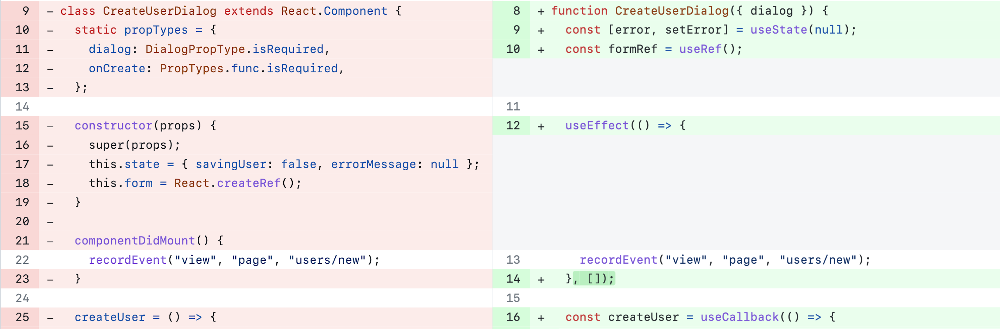
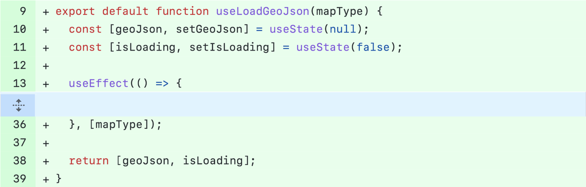
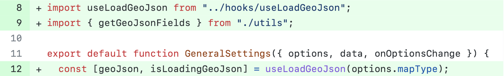

<div align="justify">

# React-Refactorings

## Introduction 

Refactoring is a well-known technique to improve software quality. However, there are still relevant domains where refactoring has not been studied in-depth, such as JavaScript front-end frameworks. Essentially, such frameworks provide abstractions—called components—for structuring and organizing the codebase of modern and responsive Web UIs. Since these UIs can reach hundreds of components, it is natural to expect that suboptimal design decisions will eventually occur in their development. Therefore, information and documentation on the refactorings performed in these components have a practical value for practitioners nowadays, particularly for front-end developers.

To fill this gap, we empirically study refactorings that developers perform when maintaining and evolving *React*-based Web applications. By manually inspecting 171 refactoring commits performed in open source projects, we catalog 45 distinct refactoring operations of which 15 are specific to *React* code, nine are adaptations of traditional refactorings for the *React* context, 16 are traditional refactorings, and five are specific to JavaScript code. The catalog of refactorings proposed in this article migth support practitioners when improving the maintainability of *React* applications.

Please feel free to make pull requests and suggestions ([Issues][Issues] tab). We want to hear from you!

## Catalog of *React* Refactorings

In the following sections, we discuss the most frequent refactorings that developers perform when maintaining and evolving *React*-based Web applications. To ease their presentation and understanding, we classified these refactoring instances into four major categories: 

* *React*-specific refactorings, which are novel refactorings that only occur in front-end code that uses *React*.

* *React*-adapted refactorings, which are refactorings that although related to the *React* context can be seen as adaptations of traditional refactorings. 

* Traditional refactorings, i.e., refactorings documented in Fowler’s catalog).

* JavaScript-specific refactorings, which  are refactorings related to JavaScript code and structures and that were not previously classified as *React*-specific or *React*-adapted refactorings.

The following table summarizes the number of distinct refactoring operations we found by category and the number of occurrences.

Category | Number of Refactorings | Occurrences
| :--- | :---: | :---:
*React*-specific refactorings  | 15 | 51
*React*-adapted refactorings  | 9 | 97
Traditional refactorings  | 16 | 74
JavaScript-specific refactorings  | 5 | 10

### *React*-specific Refactorings

We found 15 novel refactorings that only occur in front-end code that uses React. In the following table, we summarize the *React*-specific refactorings operations and the instances of each one.

Refactoring | Occurrences
| :--- | :---:
Replace class component with function component | 17
Extract stateful logic to a custom hook | 8
Replace direct mutation of state with ``setState()`` | 5
Extract conditional in render | 4
Replace access state in ``setState`` with callbacks | 3
Remove ``forceUpdatte()`` | 2
Replace third-party component with own component | 2
Remove props in initial state | 2
Replace callback bind in constructor with bind in render | 2
Remove direct DOM manipulation | 1
Remove unused props | 1
Replace HTML/JS code with third-party components | 1
Replace function component with Class component | 1
Replace function component with React.FC syntax | 1
Replace dynamic keys with stable ids | 1

#### Replace class component with function component

*React* supports class and function components. A class component is an ES6 class with local state, lifecycle control methods (e.g., ``componentDidMount()`` and ``componentDidUpdate()``) and a render method that returns what must appear in the UI. On the other hand, a function component is just a JavaScript function that accepts props (or inputs) as arguments and returns a *React* element representing the UI. For this reason, function components are simpler to understand than class components. Moreover, by using hooks, function components can access state and other *React* features

For these reasons, replacing class components with function components is a common *React*-specific refactoring, with 17 occurrences in our dataset. The following figure shows an example that replaces the ``CreateUserDialog`` class with a function component. Specifically, the refactoring (1) changes the class to a function, (2) removes the ``render`` method, (3) removes references to ``this``, (4) removes the constructor and replaces the state with a ``useState`` hook, (5) replaces the ``componentDidMount()`` lifecycle method with a ``useEffect`` hook.

<figure>

  <figcaption>Refactoring CreateUserDialog class component to function component</figcaption>
</figure>

#### Extract stateful logic to a custom hook

By default, *React* provides hooks, such as ``useState()``, for tracking state in function components. However, the logic that deals with a given state might also become duplicated in components. For example, in a chat application, more than one component may store data on the status of the users. Moreover, these components may also replicate the logic that checks whether a user is online or not. *React* Hooks allows eliminating this duplicated logic by extracting it to a custom hook, which is a JavaScript function whose name starts with ``use`` (e.g., ``useFriendStatus``). This hook usually returns the state and the function to update it (e.g., ```const [friendStatus, setFriendStatus] = useFriendStatus();``` ). Custom hooks improve reusability since the same code across multiple components is implemented in a single function.  

For example, several components in the ``Redash`` project need to load geolocation data and add it to the ``geoJson`` components state. Initially, each component had its geolocation state and the logic that loads it. Then, a refactoring was performed to extract the state and the associated logic to a single custom hook, called ``useLoadGeoJson``, as illustrated in the following figure. We found eight occurrences of this refactoring.

<figure>
  <br>
  <figcaption align="center">(a) useLoadGeoJson custom hook</figcaption><br>
</figure>

<figure>
  <br>
  <figcaption align="center">(b) The component GeneralSettings using the useLoadGeoJson hook</figcaption>
</figure>

#### Replace direct mutation of state with ``setState()``

Class components provide the ``setState()`` method, which updates the component state and indicates to the framework what needs to be re-rendered. To support this process, *React* keeps the previous state and compares it with the updated state to decide whether or not the component needs to be re-rendered. The problem occurs when the state is changed directly i.e., without calling ``setState()``. As a result, the component may not reflect the state updates.

Therefore, the solution is always use ``setState()`` to update the state. We found five occurrences of direct mutation of the state being replaced with mutation using the ``setState()`` method.

#### Replace access state in setState with callbacks

In *React*, accessing state in the ``setState()`` method can lead to inconsistencies because such updates are asynchronous, i.e., *React* may batch multiple ``setState()`` calls into a single update to increase performance. Therefore, if two ``setState`` operations are grouped they both can access the old state. For example, the following code may fail to update the ``counter`` state:

```jsx
this.setState({counter: this.state.counter + 1}) // 2
this.setState({counter: this.state.counter + 1}) // 2, not 3
```

The recommended refactoring uses a variation of ``setState()`` that accepts a function rather than an object. This function receives the previous state as an argument:

```jsx
this.setState(prevState => ({counter: prevState.counter + 1}));
```

We found three occurrences of this refactoring.

#### Extract conditional in render

*React* allows conditional rendering of UI elements, depending on the application's state—for example, a set of UI elements is rendered only when the user is logged in. However, mixing JSX code with nested conditional rendering makes the code hard to read and maintain. In our dataset, we found four refactorings that simplify such conditionals by extracting the JSX code to other components or helper methods.

#### Remove ``forceUpdatte()``

In order to automatically reflect model changes in the view, *React* re-renders a component only if its state or the props passed to it changed. However, developers can force the update of components or even reload the entire page, which may cause inconsistencies between the model and view. *React* documentation recommends to avoid all uses of ``forceUpdate()`` and to only access ``this.props`` and ``this.state`` in ``render()``. We found two refactorings that eliminate calls to ``forceUpdate()`` or ``reload()``. 

#### Replace third-party component with own component

While developing a *React* Web App,  developers can use components from a component library. This refactoring replaces a third-party component with an in-house component developed by the team. We found two occurrences of this refactoring. 

#### Remove Props in Initial State

Initializing the state with props makes the component ignore all props updates. If the props values change, the component will render its first values. We found two refactorings that eliminate the initialization of state with props. 

#### Replace callback bind in constructor with bind in render

A typical pattern for class components is using a method to be the event handler. However, class methods are not bound by default in JavaScript. Therefore, developers need to bind the methods explicitly in the component's constructor or in the render method. However, binding the methods in the render method creates a different callback each time the component render, while binding in the constructor creates a single callback instance. We found two refactorings that replace bind in the constructor with bind in the render.

#### Remove direct DOM manipulation

React uses its own representation of the DOM, called virtual DOM. When the state changes, React updates the virtual DOM and propagates the changes to the real DOM. However, manipulating the DOM using standard JavaScript code can cause inconsistencies between React’s virtual DOM and the real DOM. We found one refactoring that removes direct DOM manipulation.

#### Remove unused props

We found one refactoring that eliminates the unsed component props.

### React-adapted Refactorings

In our analysis, we found seven refactorings that, although related to the *React* context, are adaptations of traditional refactorings. For this reason, we call them as *React*-adapted refactorings. In the following table, we summarize such refactorings and highlights the traditional refactoring they are similar to.

Refactoring | Similar to | Occurrences
| :--- | :--- | :---:
Split component  | Extract Class | 38 
Extract component | Extract Class | 13 
Rename component | Rename Class | 10 
Extract JSX outside render method to component  | Extract Class | 10 
Extract HTML/JS code to component  | Extract Class | 9 
Rename props | Rename field | 7 
Merge components | Combine Functions into Class | 4 
Replace value with props | Change Value to Reference | 3 
Move Component | Move Class | 3

#### Split component

This is the most common refactoring in our dataset, with 38 occurrences. It occurs when a component starts getting too large, with many responsibilities, making it hard to maintain and test. 

#### Extract component

This refactoring occurs when parts of a component appear in multiple places. Therefore, extracting these parts into a new component allows their reuse in other places. We found 13 occurrences of this refactoring in our dataset.

#### Rename component

We found ten refactorings that rename components. This refactoring  usually occurs when the name of a component does not represent the component well, either because the component was poorly named or because its purpose evolved and the original name finished being a good choice.

#### Extract JSX outside render method to component

This refactoring enables the reuse of helper methods with JSX code in other components. In *React*, the render method---which is the only method required in a class--- returns a JSX template describing what should appear on the UI. However, when this method becomes large, developers sometimes move part of its code to separate methods, which prevents reuse decoupled from the render. Therefore, extracting these methods to new components improves reusability and allows their reuse in other pages. We found ten occurrences of this refactoring in our dataset.

#### Extract HTML/JS code to component

In a web app, duplicated UI elements are also a common design problem. For example, some buttons in an app might be very similar, changing only details such as text and image. The problem happens when the HTML/JS code that implements these buttons is duplicated, making it more difficult to maintain, reuse, and evolve. Thus, refactoring duplicated UI code to components fosters reuse and encapsulation. We found nine refactorings extracting HTML/JS code to reusable components.

#### Rename props

This refactoring is similar to a traditional rename refactoring. It occurs when the name of a prop does not represent its purpose very well. We found seven occurrences of this refactoring.

#### Merge components

This refactoring is recommended when two or more components share UI elements and logic, \ie when we have code duplication. The solution is to create a common component and move the duplicated UI elements and logic to it. We found four occurrences of this refactoring.

#### Replace value with props

This refactoring replaces a literal value that frequently changes  with a prop. We found three occurrences in our dataset.

#### Move component

This refactoring is recommended when a component is used in multiple files. In such cases, we should consider moving the component to the location where it is most used. We found three occurrences of the move component refactoring.

## About

This catalog was proposed by Fabio Ferreira and Marco Tulio Valente, from [ASERG/DCC/UFMG][ASERG].

Please feel free to make pull requests and suggestions ([Issues][Issues] tab).

<!-- Links -->
[React]: https://reactjs.org
[Facebook]: https://github.com/facebook
[ASERG]: http://aserg.labsoft.dcc.ufmg.br/
[Issues]: https://github.com/fabiosferreira/React-Code-Smells/issues
[eslint-plugin-react]: https://github.com/yannickcr/eslint-plugin-react

</div>
